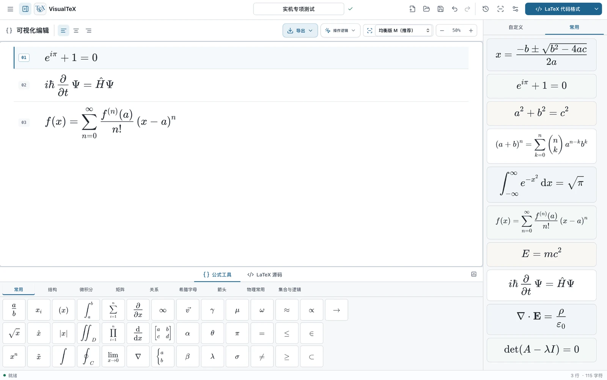
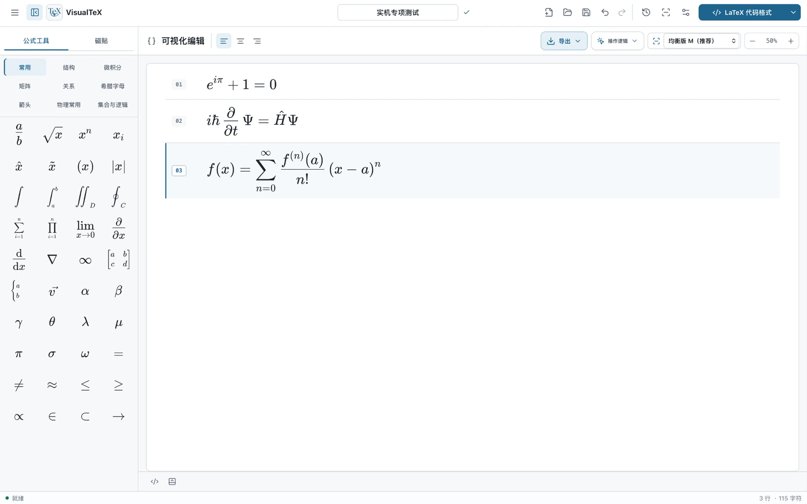
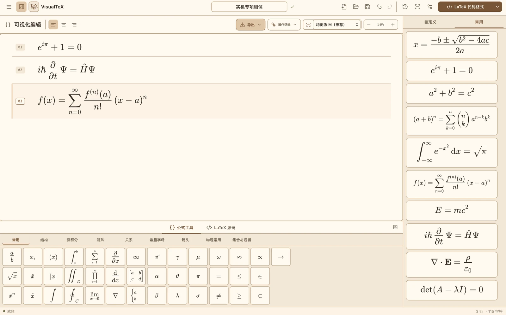
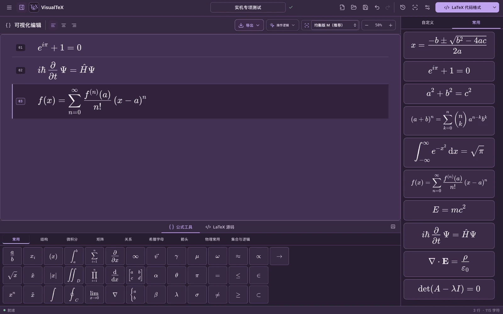
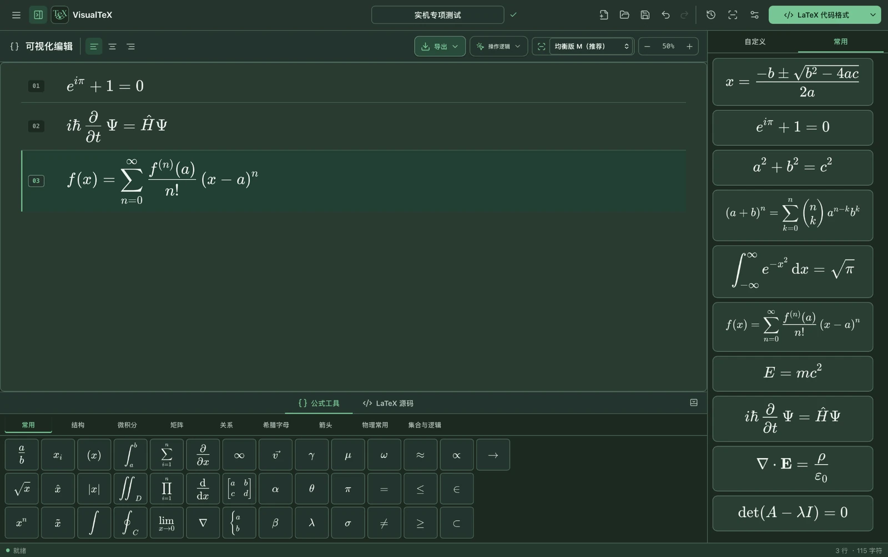

<div align="center">
  
  <h1>VisualTeX</h1>
  <p><strong>可视化公式编辑器与 Microsoft Office 原生公式插件</strong></p>
  <p><strong>Visual formula editor with native Microsoft Office integration</strong></p>
  <p>
    <a href="#中文">中文</a> · <a href="#english">English</a> ·
    <a href="https://github.com/paulhe666/visualtex/releases">Releases</a>
  </p>
</div>

---

# 中文

<div align="center">
  <p><strong>VisualTeX QQ 交流群：<code>1045801770</code></strong></p>
  <p>欢迎交流使用问题、功能建议、Office 插件与项目开发。</p>
  
</div>

VisualTeX 是一款面向数学、物理、工程与科研写作的桌面公式编辑器。它提供结构化可视化输入、LaTeX 源码编辑、本地图片公式识别，以及 Word 和 PowerPoint 原生公式工作流。

## 实际界面

以下均为 VisualTeX 的真实运行截图，不是设计稿或模拟图。第一行展示蓝白主题主界面与布局、功能设置，第二行展示三套主题配色。

### 蓝白主界面与功能布局

<p align="center">
  
  
</p>
<p align="center"><sub>蓝白主题经典布局 · 布局切换、操作逻辑与导出功能</sub></p>

### 多主题界面

<p align="center">
  
  
  
</p>
<p align="center"><sub>暖米色主题 · 深紫色主题 · 深绿色主题</sub></p>

## 主要功能

### 可视化公式编辑

- 结构化输入分式、根式、积分、求和、极限、上下标、希腊字母、集合与关系符号；
- 支持多公式行、1×1 至 10×10 矩阵、定界符和基于选区的结构插入；
- 支持标准布局与经典布局；经典布局将公式工具和 LaTeX 源码停靠在底部，并可随时折叠；
- “操作逻辑”可开关常用数学输入自动转义：`alpha` 输入希腊字母，`>=` 输入大于等于号，`pp`、`ss`、`mm`、`dd`、`eq` 分别输入加号、减号、乘号、除号和等号；关闭后所有无反斜杠快捷转义均停用，同时 `xx` 始终保留为普通变量；
- 可分别控制上下标、重音和字体命令的自动跳出，以及不同类型的命令候选框；
- `mathbb`、`mathbf`、`mathcal` 等字体命令通过反斜杠或工具栏输入，支持单字符自动跳出，也支持连续输入后按 Enter 确认；
- 文档级撤销与重做会恢复公式内容、活动行、光标和选区；
- 支持公式缩放、蓝白浅色、暖米色、深色、深紫色和深绿色主题，以及中文/英文界面、本地历史和 JSON 文档。

### LaTeX 源码

- CodeMirror 源码编辑区与可视化公式双向同步；
- 支持纯 LaTeX、`$...$`、`\(...\)`、`\[...\]`、`equation`、`align`、`gather`、`multline`、`split` 等格式；
- 多行环境自动处理顶层对齐符，同时保护矩阵内部的 `&` 与换行结构；
- 复制公式不要求安装 TeX Live。

### 文档导出与更新

- 从顶部“导出”菜单直接生成 Markdown、SVG 或 PNG；
- 首次选择导出目录后自动记住路径，后续可直接导出当前公式文档；
- Markdown 使用通用数学块语法保存多行公式，SVG 与 PNG 适合网页、笔记和演示文稿；
- 支持启动时自动检查更新、中文/英文更新说明和手动检查更新。

### 本地图片公式识别

- 选择、拖入或直接粘贴公式图片，识别结果可插回原光标位置；
- 使用 PaddleOCR PP-FormulaNet plus-S、plus-M 和 plus-L；
- 支持深色背景、透明图片、进度显示和取消；
- 图片只在本机处理，不上传第三方服务。

## macOS 版本

macOS 版本位于 [`apps/macos`](apps/macos)，使用完全离线的原生 Office 集成：


- Word 通过 DOTM 全局模板加载 VisualTeX 标签页；
- PowerPoint 通过固定路径 PPAM 加载项工作；
- VBA、AppleScriptTask、Office Group Container 与 Tauri 本地窗口组成离线 Session 流程；
- Word 支持图片公式和原生 OMML 行内/行间公式；
- 支持图片公式转换为 Word 原生公式、图片与 OMML 公式编号、交叉引用、按钮编辑和双击编辑；
- 图片行间公式编号采用稳定的静态显示与原生 SEQ 引用源，点击或更新字段时不会发生数字下沉；
- PowerPoint 支持新建、替换、删除和双击编辑 VisualTeX 公式；
- 原生加载项不依赖 Office.js、XML Manifest、系统可信证书或外部网络；本地 companion 仅为 Session/OCR 使用私有回环 TLS。

## Windows 版本

Windows 版本位于 [`apps/windows`](apps/windows)，使用 VSTO 与真正的 COM/OLE 公式对象：


- Word 和 PowerPoint 使用原生 VSTO Ribbon 与 Office 事件；
- 专业模式插入真实的 `VisualTeX.Formula.1` OLE 对象；
- OLE 对象保存公式元数据、EMF 矢量预览与 PNG 兼容预览；
- Word 支持 OLE 与 OMML 行内/行间公式、格式转换、编号和引用；
- PowerPoint 支持 OLE 公式的新建、编辑、删除与图片导出；
- Office 原生双击可重新打开 VisualTeX 编辑器；
- 兼容图片模式用于跨平台文档和旧公式迁移。

## 仓库结构

```text
visualtex/
├── apps/
│   ├── macos/       # 独立 macOS 应用、Tauri、DOTM/PPAM、OCR 与测试
│   └── windows/     # 独立 Windows 应用、Tauri、VSTO/OLE、OCR 与测试
├── docs/            # 仓库架构与真实界面截图
├── tools/           # 顶层结构检查
├── .github/         # 按平台独立运行的 CI
├── package.json     # 只负责调度两个子项目
└── README.md
```

两个子项目不共享 `src`、`src-tauri`、编辑器组件、Office Session 实现、`package-lock.json` 或 `Cargo.lock`。

## 本地开发

```bash
# 安装两个平台各自的依赖
npm run bootstrap

# 分别构建
npm run build:macos
npm run build:windows

# 检查仓库隔离结构并构建两个前端
npm run check
```

平台原生打包和 Office 验收请进入对应目录执行：

```bash
cd apps/macos
npm run tauri:build

cd ../windows
npm run tauri:build
```

详细设计见 [`docs/ARCHITECTURE.md`](docs/ARCHITECTURE.md)。

---

# English

VisualTeX is a desktop formula editor for mathematics, physics, engineering, and scientific writing. It combines structured visual input, editable LaTeX source, local formula-image recognition, and native Word and PowerPoint workflows.

## Real application renders

The following images are real VisualTeX runtime captures, not mockups. The first row shows the blue-and-white main workspace and layout or feature settings; the second row shows three additional colour themes.

### Main workspace and controls

<p align="center">
  
  
</p>
<p align="center"><sub>Blue-and-white classic workspace · Layout, input-behaviour, and export controls</sub></p>

### Colour themes

<p align="center">
  
  
  
</p>
<p align="center"><sub>Warm beige · Deep purple · Deep green</sub></p>

## Core features

### Visual formula editing

- Structured fractions, roots, integrals, sums, limits, scripts, Greek letters, sets, and relations;
- Multiple formula rows, 1×1 to 10×10 matrices, delimiters, and selection-aware structure insertion;
- Standard and classic workspace layouts; the classic layout docks formula tools and LaTeX source at the bottom and can be collapsed;
- Optional plain-text conversion: `alpha` inserts a Greek letter, `>=` inserts greater-than-or-equal, and `pp`, `ss`, `mm`, `dd`, and `eq` insert plus, minus, multiplication, division, and equals; disabling it turns off every no-backslash shortcut, while `xx` always remains ordinary variable input;
- Independent controls for automatic exits from scripts, accents, and font commands, plus separate command-suggestion panels;
- Font wrappers such as `mathbb`, `mathbf`, and `mathcal` are entered with a backslash or toolbar button and can exit after one character or accept multiple characters and confirm with Enter;
- Document-level undo and redo with active-row, caret, and selection restoration;
- Formula zoom, blue-and-white light, warm beige, dark, deep purple, and deep green themes, Chinese and English UI, local history, and JSON documents.

### LaTeX source

- Two-way synchronization between the visual editor and CodeMirror source editor;
- Raw LaTeX plus `$...$`, `\(...\)`, `\[...\]`, `equation`, `align`, `gather`, `multline`, `split`, and related formats;
- Top-level alignment handling that preserves matrix-internal separators and line breaks;
- Formula copying without a TeX Live installation.

### Document export and updates

- Export the current formula document directly as Markdown, SVG, or PNG;
- Remember the selected export directory after the first export;
- Markdown uses common display-math blocks, while SVG and PNG are ready for web pages, notes, and presentations;
- Automatic startup update checks, localized release notes, and manual update checks.

### Local formula OCR

- Select, drag, or paste formula images and insert recognized LaTeX at the saved caret;
- PaddleOCR PP-FormulaNet plus-S, plus-M, and plus-L models;
- Dark-background and transparent-image preprocessing, progress reporting, and cancellation;
- Images remain on the local device.

## macOS application

The macOS application lives in [`apps/macos`](apps/macos) and uses a fully offline native Office route:


- A Word DOTM global template and a fixed-path PowerPoint PPAM add-in;
- VBA, AppleScriptTask, the Office Group Container, and local Tauri Session windows;
- Word picture formulas and native OMML inline or display formulas;
- Picture-to-OMML conversion, picture and OMML equation numbering, cross-references, Ribbon editing, and double-click editing;
- Stable static picture-number display backed by a native SEQ source, preventing the number from dropping after selection or field refresh;
- PowerPoint formula creation, replacement, deletion, and double-click editing;
- The native add-ins require no Office.js, XML manifests, system-trusted certificate, or external network; a private loopback TLS companion is used only for Session/OCR services.

## Windows application

The Windows application lives in [`apps/windows`](apps/windows) and uses VSTO with real COM/OLE formula objects:


- Native VSTO Ribbons and Office events for Word and PowerPoint;
- Real `VisualTeX.Formula.1` OLE objects in professional mode;
- Embedded formula metadata, EMF vector previews, and PNG compatibility previews;
- Word OLE and OMML inline/display formulas, conversion, numbering, and references;
- PowerPoint OLE creation, editing, deletion, and picture export;
- Native Office double-click activation;
- A picture mode for cross-platform documents and legacy migration.

## Repository layout

```text
visualtex/
├── apps/
│   ├── macos/       # Independent macOS editor, Tauri app, DOTM/PPAM, OCR, tests
│   └── windows/     # Independent Windows editor, Tauri app, VSTO/OLE, OCR, tests
├── docs/            # Repository architecture and real screenshots
├── tools/           # Top-level structure verification
├── .github/         # Platform-specific CI workflows
├── package.json     # Dispatches commands to the two applications only
└── README.md
```

The two applications do not share `src`, `src-tauri`, editor components, Office Session implementations, `package-lock.json`, or `Cargo.lock`.

## Development

```bash
npm run bootstrap
npm run build:macos
npm run build:windows
npm run check
```

Run native packaging and Office acceptance from the corresponding application directory:

```bash
cd apps/macos
npm run tauri:build

cd ../windows
npm run tauri:build
```

See [`docs/ARCHITECTURE.md`](docs/ARCHITECTURE.md) for the repository design.
